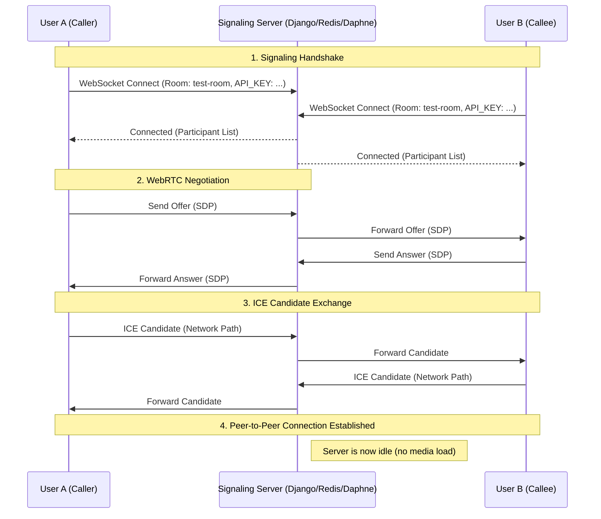

# VOCALIS is a VoIP-as-a-Service (VaaS)

A professional, high-performance VoIP infrastructure and dashboard designed for SaaS developers. This project provides a robust signaling server, a premium monitoring dashboard, and a plug-and-play JavaScript SDK.

LIVE WORKING - https://voip-webapp.vercel.app/

---

## 🏗 System Architecture & Code Flow

The application operates on a **Signaling-First Architecture** using WebRTC for peer-to-peer media transport.

### 1. Signaling Process (The "Handshake")
Since WebRTC cannot connect two users directly without knowing their IP addresses and capabilities, this project uses a internal **Signaling Server** (Django + Channels + Redis).

1.  **Connection**: A client (Dashboard or SDK) connects via WebSockets to `ws://server/ws/signaling/[room_name]/?api_key=[key]`.

2.  **Presence**: The `signaling/consumers.py` handles the connection, verifies the API Key against the database, and adds the user to a Redis-backed "Group" (the room).

3.  **Offer/Answer**: 
    -   **Peer A** (Caller) generates an **SDP Offer** (local media capabilities) and sends it over the WebSocket.
    -   **Server** broadcasts this offer to **Peer B** (Callee) within the same room.
    -   **Peer B** receives the offer, generates an **SDP Answer**, and sends it back.
    
4.  **ICE Candidates**: Throughout this process, both peers generate "ICE Candidates" (possible network paths). The signaling server relays these candidates until a direct P2P connection is established.

### 2. Media Transport
- Once signaling is complete, the browser takes over. No voice data goes through the Django server (saving you bandwidth).
- **STUN/TURN**: The project is configured with Google's STUN server for local NAT traversal. For restricted corporate networks, the included `voip-configs/install_coturn.sh` script deploys a **TURN Server** to relay media when P2P fails.

### 3. AI Insights (Mocked)
- During a call, the `useWebRTC.js` hook captures audio chunks and sends them to the `/api/calls/upload/` endpoint.
- In production, this can be hooked into OpenAI Whisper or Google Speech-to-Text for real-time transcription.

---

## 🛠 Tech Stack

| Component | Technology | Description |
| :--- | :--- | :--- |
| **Frontend** | [React](https://reactjs.org/) + [Vite](https://vitejs.dev/) | High-performance SPA with Framer Motion animations. |
| **Backend** | [Django](https://www.djangoproject.com/) + [Channels](https://channels.readthedocs.io/) | Asynchronous Python backend for WebSockets. |
| **Server** | [Daphne](https://github.com/django/daphne) | ASGI server for handling real-time signaling. |
| **Database** | [Neon (Postgres)](https://neon.tech/) | Serverless PostgreSQL for reliable data storage. |
| **Redis** | [Upstash](https://upstash.com/) | Serverless Redis for signaling state & message brokering. |
| **UI Icons** | [Lucide React](https://lucide.dev/) | Pixel-perfect modern icons. |
| **Animations** | [Framer Motion](https://www.framer.com/motion/) | Smooth, buttery-grade UI transitions. |

---

## 🚀 Step-by-Step Deployment Guide (100% Free)

Follow these steps to get your VoIP project live in under 15 minutes.

### 1. Database: Neon (Postgres)
1.  Go to [Neon.tech](https://neon.tech) and create a free account.
2.  Create a new project named `voip-backend`.
3.  Copy the **Connection String** (it starts with `postgresql://...`).
4.  Save this; you'll need it as `DATABASE_URL`.

### 2. Signaling: Upstash (Redis)
1.  Go to [Upstash.com](https://upstash.com).
2.  Create a **Serverless Redis** database.
3.  Copy the **Redis URL** (it starts with `rediss://...` or `redis://...`).
4.  Save this; you'll need it as `REDIS_URL`.

### 3. Backend: Render
1.  Go to [Render.com](https://render.com).
2.  **New + Web Service**.
3.  Connect your GitHub repository.
4.  **Settings**:
    - **Root Directory**: `backend`
    - **Build Command**: `pip install -r requirements.txt && python manage.py migrate`
    - **Start Command**: `daphne core.asgi:application` (Handles both HTTP and WebSockets).
5.  **Environment Variables**:
    - `DATABASE_URL`: (From Neon)
    - `REDIS_URL`: (From Upstash)
    - `DJANGO_SECRET_KEY`: (Any random string)
    - `DJANGO_DEBUG`: `False`
    - `DJANGO_ALLOWED_HOSTS`: `your-app-name.onrender.com`

### 4. Frontend: Vercel
1.  Go to [Vercel.com](https://vercel.com).
2.  **Add New Project** + Select your GitHub repo.
3.  **Settings**:
    - **Root Directory**: `frontend-prime`
    - **Framework Preset**: `Vite`
4.  **Environment Variables**:
    - `VITE_API_URL`: `https://your-app-name.onrender.com`
    - `VITE_WS_URL`: `wss://your-app-name.onrender.com`
5.  **Deploy**.

### 5. Security & Verification
1.  Once Render is live, go to the URL. If you see a "Not Found" or a Django welcome page, it's working.
2.  In your React app, ensure you use the `VITE_WS_URL` for the signaling connection.
3.  Open the Vercel URL and test a call between two tabs!

---

## 📖 How to Use the App
**Vocalis** makes it incredibly easy to start a secure call:
1.  **Open Dashboard**: Launch your Vercel URL.
2.  **Set Room**: Enter a unique room name (e.g., `meeting-123`) in the top search bar.
3.  **Connect**: Click **Join Room**. You're now live on the signaling server!
4.  **Invite**: Ask your friend to join the *same* room name on their device.
5.  **Call**: Once they appear in the "Active Participants" list, click the **Green Phone Icon** to start the peer-to-peer call.
6.  **Need Help?**: Click the **"How to Use"** button in the sidebar for a visual guide anytime!

---

## 🛠 Project Structure Breakdown

| Folder | Responsibility |
| :--- | :--- |
| `/backend` | Django + Channels. Handles room management, history, and API key verification. |
| `/frontend-prime` | React + Framer Motion. The "Glassmorphism" management dashboard. |
| `/sdk` | `voip-sdk.js`. A class-based wrapper for any external JS app to join calls. |
| `/voip-configs` | Automated bash scripts for infrastructure setup. |

---

## � What's Missing? (Roadmap currently Work in Progress)
To make this a complete commercial SaaS, consider adding:
1.  **AI integration which will analyze the conversation and context and accordingly summerize the whole call in breif and help to take decision realtime too.
2.  **User Authentication**: Replace the simple Admin Gate with Django's built-in User/JWT auth for customers.
3.  **Billing Integration**: Add Stripe to charge users per second of call time.
4.  **Mobile Support**: Use the SDK within a React Native or Flutter app (RTCPeerConnection is supported).
5.  **Multi-Party Calls**: Currently optimized for 1-on-1. For 3+ people, you would need an **SFU (Selective Forwarding Unit)** like Janus or Mediasoup.
